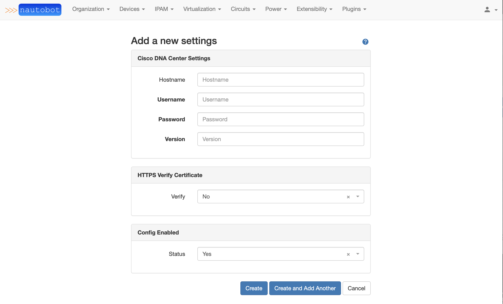
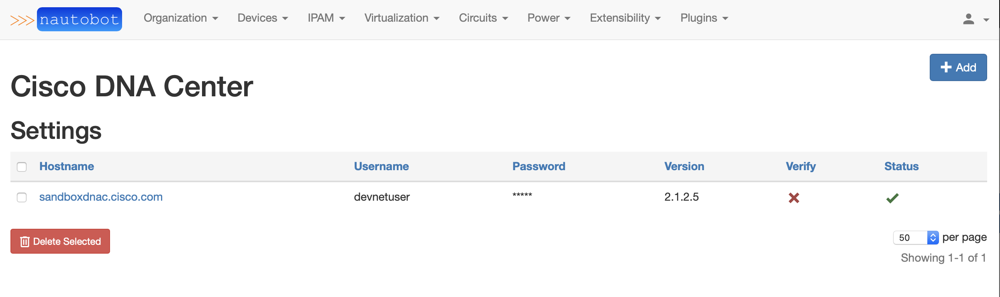
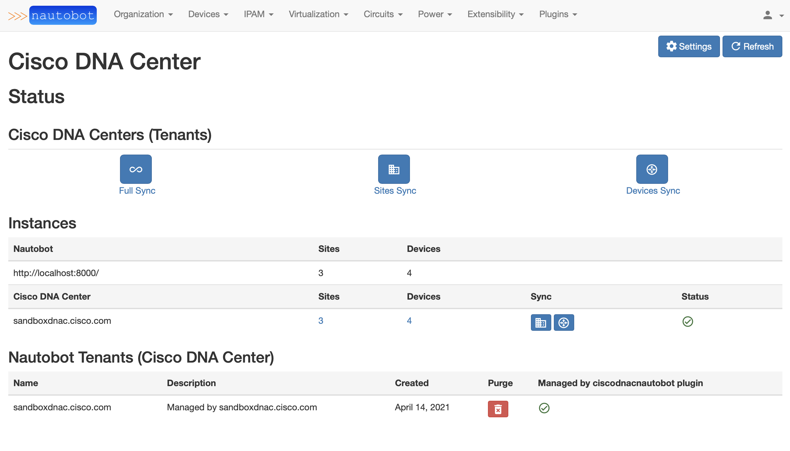
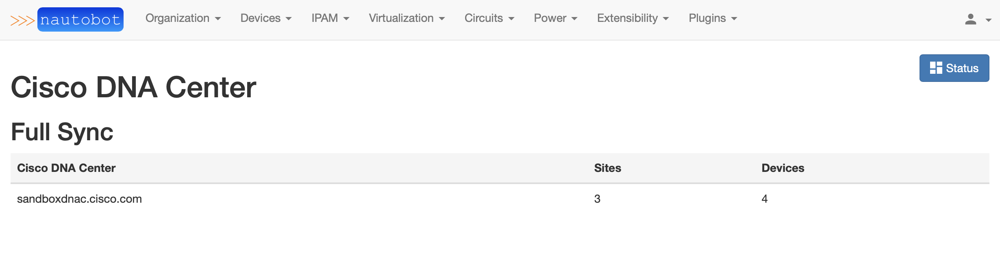
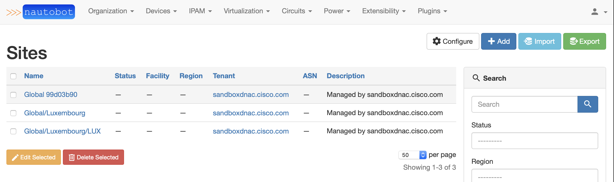
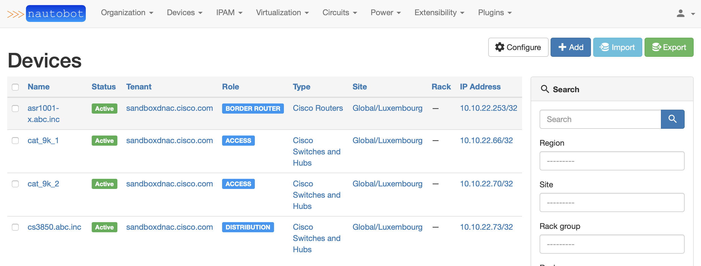

# ciscodnacnautobot
This is a fork from [ciscodnacnetbox](https://github.com/robertcsapo/ciscodnacnetbox) ported to Nautobot

*Cisco DNA Center Integration with Nautbot*

---

```ciscodnacnautbot``` is a Nautbot Plugin for Cisco DNA Center.  
It uses the Cisco DNA Center Platform APIs to sync data.

## Prerequisites
- Cisco DNA Center
    - Supported release: 1.3.3+
- Nautbot
    - Tested with: v1.0.0b3
- Python
  - Version: 3.3+

## Data that is synced
- [x] Sites
- [x] Devices
- [x] IP Address (/32 of Devices)

## Screenshots
### Settings  
  

### Status  

### Sync  
  

### Nautobot Inventory
  


## Getting Started

- Install the plugin from source
    ```
    # sudo -iu nautobot
    # git clone https://github.com/joakimnyden/ciscodnacnautobot.git
    # pip3 install -e ciscodnacnautbot
    ```


- Enable the plugin in ```nautobot_config.py``` of Nautobot
    ```
    PLUGINS = [
        'ciscodnacnautobot',
    ]
    ```
(More details at https://nautobot.readthedocs.io/en/latest/plugins/)


## Sync your data from Cisco DNA Center to Nautbot

* Add your Cisco DNA Center(s) in Settings at the ciscodnacnautbot plugin
* Check status dashboard that API calls are OK towards your Cisco DNA Center (refresh if being cached)
* Use the buttons on the Dashboard to sync (Sites is mandatory for Devices to be assigned in Nautobot)

## Technologies & Frameworks Used

**Cisco Products & Services:**

- [Cisco DNA Center](https://developer.cisco.com/docs/dna-center/#!cisco-dna-center-platform-overview)

**Third-Party Products & Services:**

- [Nautobot](https://github.com/nautobot/nautobot)

**Tools & Frameworks:**

- [dnacentersdk](https://github.com/cisco-en-programmability/dnacentersdk) (Python SDK)
- [django](https://www.djangoproject.com/)

## Authors & Maintainers

- Robert Csapo <rcsapo@cisco.com> [Author]
- Joakim Nydén <joakim.nyden@cygate.se> [Maintainer/Contributor]


## License

This project is licensed to you under the terms of the [Cisco Sample
Code License](./LICENSE).
